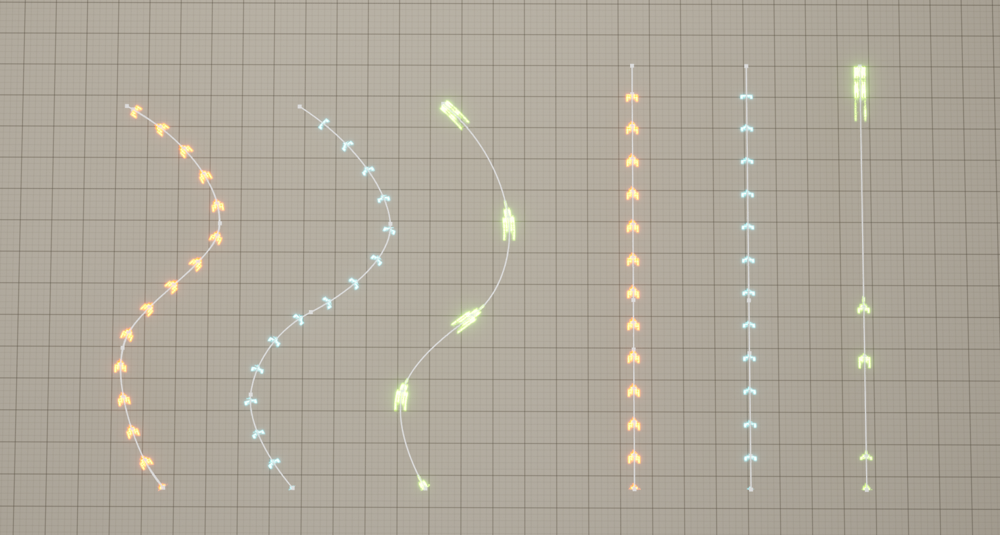
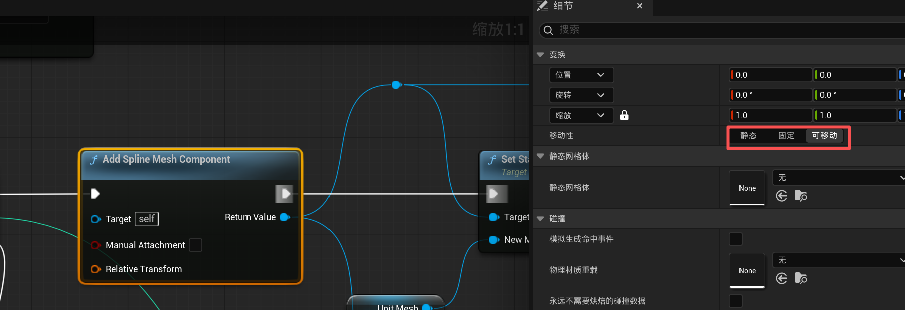

# SplineMeshDemo

本项目用于展示三种 `SplineMesh` 生成方式的区别与效果，便于在 UE 中对比不同方案在视觉表现和运行时行为上的差异。

## 项目目标

项目主要演示以下三种方式：

1. 以 `Spline` 顶点添加 `Mesh`
2. 以固定距离添加 `Mesh`
3. 优化后的以固定距离添加 `Mesh`

## 三种方案说明

### 1) 以 Spline 顶点添加 Mesh

- 按照 `Spline` 已有顶点（控制点）逐段添加 `SplineMesh`。
- 缺点是会受到顶点间距离影响：当相邻顶点距离不一致时，`Mesh` 会发生拉伸或压缩。
- 结果是整体视觉上 `Mesh` 大小不一，密度不均匀。

### 2) 以固定距离添加 Mesh

- 沿 `Spline` 按固定步长进行采样并添加 `SplineMesh`，可避免因控制点稀疏/密集导致的尺寸变化。
- 优点是能够显著改善第 1 种方式中的拉伸问题，让每段 `Mesh` 长度更稳定。
- 可能的问题是拼接处过渡不够丝滑，原因之一可能是过渡点切线（Tangent）计算存在误差。

### 3) 优化后的固定距离添加 Mesh

- 在第 2 种方式基础上进行优化，核心思路参考：
  - <https://blog.csdn.net/grayrail/article/details/133747086>
- 主要做法：额外增加一条 `Spline`，用于辅助在第二条 `Spline` 上添加等距顶点，再基于这些点生成 `SplineMesh`。
- 这样可以进一步改善拼接过渡效果，减少“接缝不丝滑”的问题。
- 备注：如果能够直接获取到等距顶点，也可以直接采用第 2 种方式实现，从而节省一部分性能开销。

## Runtime 生成注意事项

如果要在 Runtime 下动态生成 `SplineMesh`，请确保新建的 `SplineMeshComponent` 的 Mobility 为 **Movable**，而不是 **Static**。否则可能出现运行时更新失败或显示不符合预期的问题。

